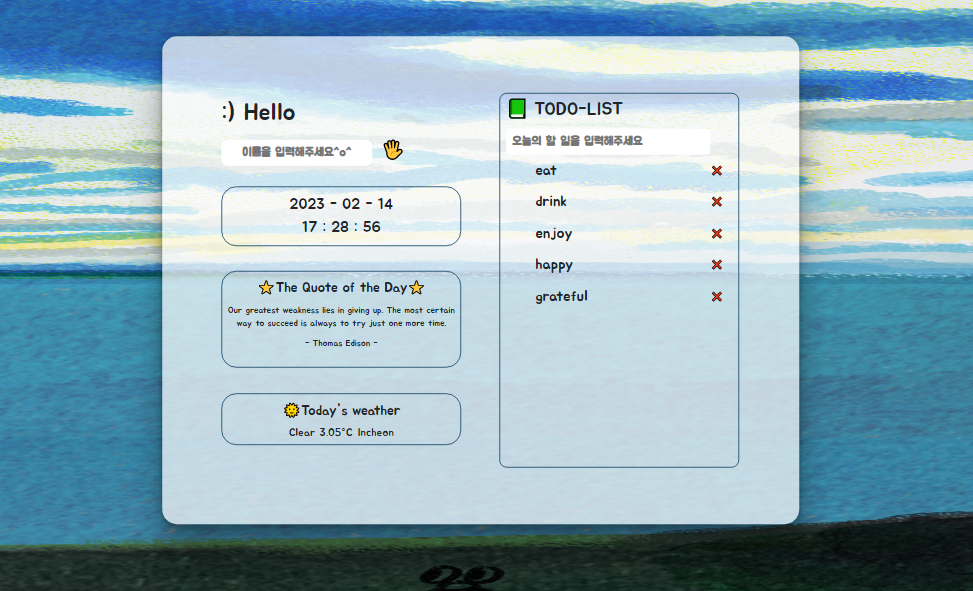

# Momentum
:point_right:로그인, 날짜, 시간, 명언 랜덤 배정, 화면 랜덤 배정, todo리스트 작성하고 localStorage에 저장, 삭제 기능 구현

:clapper: 데모앱:[MOMENTUM](https://momentum-std.netlify.app/)
## :memo:기능
+ 유저가 로그인 input에 이름을 입력하면 localStroage에 저장되어 새로고침해도 로그인 유지가 가능하다.
+ 화면을 새로고침하면 랜덤으로 바탕화면이 바뀐다.
+ 현재 날짜, 시간을 알려준다.
+ 새로고침하면 '오늘의 명언'을 랜덤으로 하나씩 화면에 출력한다.
+ 현재 내가 위치한 지역의 날씨를 알려준다.
+ TODOLIST의 input에 입력한 값을 localStorage에 저장했기 때문에 새로고침해도 값이 유지되며 
+ TODOLIST의 삭제 표시를 누르면 화면과 localStorage에서도 사라진다.

## :hammer:사용한 기술
+ HTML
+ CSS
+ Vanila Javascript
